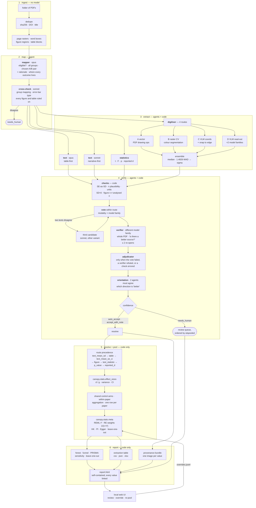

# Canopy — architecture

How a folder of PDFs becomes a forest plot, and what stops each step from lying to you.

The organising rule is a division of labour: **models read, code computes.** An agent's job is to
report what a paper says and where it says it. Every derived quantity — every effect size,
variance, weight, τ², interval — is produced by `canopy/stats/`, from values a human can check
against the page. A static test asserts that no agent output schema even *contains* a field named
`d`, `g`, `hedges`, `cohen`, `smd`, `effect_size` or `pooled_sd`, so the rule cannot erode by
accident.

---

## The pipeline



Each of the five per-paper stages writes `runs/<run>/papers/<sha12>/<stage>.json` and is skipped
when that file exists under `--resume`. Writes are atomic (temp file in the same directory, fsync,
rename) so a run killed mid-write cannot leave a stage file that `--resume` trusts.

---

## Models and roles

| role | model | used by |
|---|---|---|
| `primary` | `claude-opus-5` | mapper, text extractor (table-first), statistics reader, digitiser read-outs and coordinates |
| `secondary` | `claude-sonnet-5` | cross-check, second text extractor (narrative-first), third candidate, verifier |
| `adjudicator` | `claude-opus-5` | adjudication of surviving disagreements |
| `adjudicator_max` | `claude-fable-5` | optional maximum-effort adjudication |

Overridable per run (`--models` in the API, per-role fields in the UI's Advanced panel). The
constraint the pipeline enforces is **not** which model: it is that a verifier never shares a model
family with the candidate it is judging, and that orientation and group mapping require two
independent agreements.

The provider seam is `canopy/llm/providers.py`: `LLMProvider` with `AnthropicProvider`,
`ReplayProvider` (recorded fixtures) and `FakeProvider` (tests). `LLMClient` adds the
content-addressed disk cache, the budget reservation, `stop_reason` checking, truncation retry, and
a per-call `LLMCall` record (request id, tokens, cache reads, effort, prompt version, schema hash,
served model, image hashes, latency, cost).

---

## Verification gates

The gates are the product. In order:

| gate | what it does | what failing it means |
|---|---|---|
| **grounding** | every quoted number must be found in the PDF's own text layer, with numeric normalisation on both sides, a table cell-level check, ±1 page then whole-document fallback | the candidate is dropped or flagged `page_corrected` |
| **deterministic checks** | SE reported as SD, dispersion ≈ 0, n outside the paper's own roster, unit mismatch, figure n ≠ analysed n, points under-counted vs n, mixed analysis metric within a paper | a `CheckFlag` on the cell; some are fatal, some are notes |
| **vote within route** | modality × model family; means within max(2 % of axis range, 0.5 tick), error half-lengths within max(10 %, 0.5 px); printed values compared at the *coarser* printed precision | disagreement asks for a third candidate, then adjudication |
| **verifier** | a different model family, given the **whole PDF**, asked to confirm and to say whether a better source exists anywhere in the paper; at most 2 re-opens, each with a stronger reader | `refuted` sends the cell to adjudication |
| **adjudicator** | only invoked when the vote failed, a verifier refuted, or a check errored; must ground its answer in a quote | `needs_human` |
| **orientation** | which direction of the measure is "better", decided once per (outcome, measure) from the paper's own wording; **two agents must agree** | `needs_human` for every cell that used it |
| **convertibility** | a t or F only becomes a d when the design is `independent_t` or `one_way_between` and df ≈ nA + nB − 2 (±2) | `NotConvertible` → `route="not_convertible"`, kept and reported, never silently dropped |

Rows that fail end in the review queue, ordered by **how far the pooled estimate would move** if
they were included — so the first thing a human looks at is the thing that matters most.

---

## Data model

`canopy/models.py`, all pydantic. The chain of custody runs left to right:

```
PaperRecord ─▶ StudyMap ─▶ DatasetSpec ─▶ OutcomeSources ─▶ Source
                                              │
                                              ▼
                                          Candidate ─▶ Verdict ─▶ EffectSizeRecord ─▶ MetaResult
```

| type | holds | never holds |
|---|---|---|
| `PaperRecord` | pages, word boxes, figure regions, table blocks, rasters (ingestion, no model) | anything a model said |
| `StudyMap` | citation, eligibility + rationale, every group listed, the chosen pair + rationale, per-outcome source locations with quotes | numbers read out of those sources |
| `DatasetSpec` | one independent A-vs-B contrast: groups, n, experiment, `shared_control`, `exposure_order`, `cluster_id`, moderators | |
| `Candidate` | **one extractor's** reading: mean, dispersion + type, n, unit, `value_as_written`, quote, page, locator, crop path, grounding result, digitisation sigma, and for statistics the design/df/tails/p-kind | any effect size |
| `Verdict` | the resolved value for one (dataset, outcome, group): vote outcome, verifier result, flags, confidence bucket, orientation, the candidate ids it accepted | |
| `EffectSizeRecord` | d/g, variance, SE, CI, the estimator and variance method used, the **conversion chain**, routes available and why each earlier one was rejected, the inputs actually fed to the formula, digitisation variance share, confidence, flags, moderators | anything a model computed |
| `MetaResult` | k, estimate, CI, τ², Q, both I² conventions, RE weights, three prediction intervals | |

Every enum has an `unknown` / `not_reported` member, because "the paper does not say" is a
different fact from "the value is zero", and the difference has to survive to the report.

---

## Provenance guarantees

1. **Every value has a picture.** `provenance_bundle` writes one image and one JSON per candidate:
   a page crop with the extractor's own quote highlighted, or the figure with the digitiser's marks
   drawn on it. When the quote cannot be located in the page text the record says so
   (`matched: false`) and still writes the page — a crop that silently highlights the wrong place
   is worse than no crop.
2. **Every number in the report is re-derivable.** `canopy validate RUN_DIR` re-pools the entire
   run from `papers/*/resolve.json` with **no model calls** and lists any artefact the manifest
   promises but cannot show. If it disagrees with `report.html`, the report is wrong.
3. **Every conversion is written down.** `EffectSizeRecord.conversion_steps` names each step from
   what was printed to the effect size ("SE 1.2 → SD 4.16 (n = 12)", "Cohen's d from means",
   "oriented: higher is worse"), and `routes_rejected` says why each higher-precedence route was
   not used.
4. **The protocol travels with the run.** `runs/<run>/protocol.yaml` is the protocol the stage
   files were produced under, with the profile resolved into it; `manifest.protocol_hash` pins it.
5. **Human decisions are append-only.** `overrides.jsonl` records every override with a
   justification, a sequence number, a timestamp and an actor, and is re-applied on every re-pool,
   so a reviewed analysis survives `--resume` and can be audited.
6. **The report is self-contained.** `report.html` inlines its CSS, makes no external request, and
   escapes every string that came from a PDF or a model.

---

## The local server

`canopy/server/`, FastAPI + a static SPA with no build step and no CDN.

| concern | baseline |
|---|---|
| binding | `127.0.0.1` by default; a `Host` guard rejects anything else |
| authentication | a per-run bearer token; `?token=` is accepted only for `EventSource` and ``, which cannot set headers |
| uploads | magic-byte and size checked, stored as `<sha256>.pdf` — the client's filename is never a path |
| artefacts | served by manifest id through `safe_run_path`, so a crafted path cannot escape the run directory |
| ingestion | runs in a **subprocess** with a timeout (`python -m canopy.server.pdf_probe`), so a malicious or malformed PDF cannot hang or crash the server |
| the API key | never echoed; `/api/settings` reports only "configured: yes/no" |
| output escaping | every PDF- or model-derived string is escaped before it reaches the page |
| model calls | `POST /repool` makes **none** — it re-applies the override log to stage files already on disk |

It is a **local tool**, not a multi-tenant service: there is no user model, and the per-run token
is there to stop another process on the same machine reading a run, not to survive an untrusted
network.

---

## Where things live

```
canopy/
├── models.py            every pydantic type above; the contract between stages
├── protocol.py          load, validate, resolve profiles, dump
├── config.py            .env loading, model roles (the key is never printed)
├── llm/                 client, provider seam, disk cache, budget, prompts
├── ingest/              PDF → pages, words, figure regions, tables; dedupe
├── agents/              mapper, text extractor, statistics reader, verifier,
│                        adjudicator, orientation (each: prompt + schema + parse)
├── digitize/            the four routes: vector, cv, vlm, calibrate, overlay, digitizer
├── verify/              deterministic checks, voting, confidence buckets
├── stats/               effect_sizes, conversions, meta  ← ALL arithmetic
├── pipeline/            run (orchestrator), state, resolve, aggregate, overrides
├── report/              theme, forest, tables, provenance, methods_fig, html, outputs
├── server/              FastAPI app, jobs, SSE, uploads, overrides, static SPA
└── profiles/            metafor.yaml, cisneros2024.yaml
```

`canopy/` contains **nothing domain-specific**. Direction labels, moderator columns, outcome
definitions, eligibility text and the digitiser's axis hints all come from the protocol. Everything
that knows about ageing and adaptation lives in `examples/protocols/` and `validation/`.
